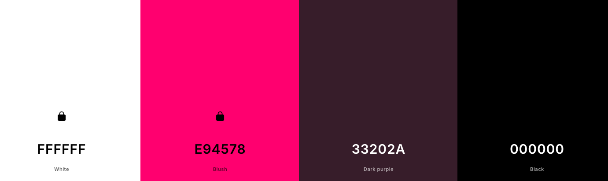

# Flamingo Terrace

## Introduction

To begin the presentation of this project, I will take the liberty of sharing a bit about my life first. I am a chef; that has been my profession for at least the last 10 years of my life. It's quite far from programming, but both have something in common: they are great tools for building things.

I can no longer keep working in a kitchen, so I had to seek a different path. I never got to have my own restaurant; perhaps in the future it will exist physically, but for now, you can visit it online.

The development of this project could be said to have started five months ago with the first project (link: https://fenasti.github.io/Catering/index.html). After developing the website for some clients with a catering project called Flamingo, we can see that the business has prospered, and they have been able to move to their own permanent location.

Logically, this new business needs a rebranding and to refresh its concept for this new stage.

## Development

### Proposal

The logo and the playful essence of its presentation would be preserved, focusing on a pink inspired by the color of the flamingo. The color palette would be chosen based on the same color from the logo (#E94578), a bright pink that evokes the vibrant colors of summer.

In search of a minimalist palette, a complementary color generator was asked to provide a color that would play with pink, black, and white. The color it generated (#33202A) was a perfect purple to add a touch of sobriety to the strong pink, which suggests the opposite.

The project began with the ideation phase, during which I outlined on paper the essential components that should be included.

- A base.html template with a nav-bar and a footer
- A Home/Index template as the homepage.
- Reservations app and template with a form to request a reservation.
- An about.html where is some information of the restaurant.
- Access to a web version of the menu.

I decided to separate it in 3 main url link paths and to provide the menu as a donwload pdf link also in the nav-bar.
As the Signup, Signin and Logout pages and all the client user functions would be exclusive related to the Reservation view, i solved to blend and display all together in the same place with conditional URL paths.

### Agile

First is to create the repository of the project using the code-institute template provided. Creation of the Project instance and connect it to the project repository. Using Agile to separate themain functions in the most basic tasks to build the apps with the issues User Story template that was was previous created, and display it in the Issues board separating them in All, In Progress, Done and Not Implemented for the functions that were not possible to add to the project because of lack of time or current experience.

https://github.com/users/fenasti/projects/2

### Process

The first steps of creating the Django project where very straight forward.

In order:
- Run the repository in gitpod with the providen template.

- Install Django using the pip command: **pip install django**.

- Create a New Django Projec using: **django-admin startproject (in this case "restaurant")** and make the fisrt migration.

- Connect to postgress with the provided database url in the env.py file and in the same way providing the url into the config vars from Heroku.

- Provide the dev enviroment url in the ALLOWED_HOST variable in settings allong with the Heroku url.

- Create the requirements.txt file, create the path in the Procfile using gunicorn and freeze the installed apps.

- Now is possible to create the Superuser using: **python3 manage.py createsuperuser**

- Migrate the changes and now is the moment to start creating the django apps.

### Apps

To create an app in Django, the process is always the same. It starts with the command:
**python3 manage.py startapp (app name)**
Next, you need to register the app in the INSTALLED_APPS section of the settings.py file.

#### Development Steps:
Model Creation: Begin by defining your models in models.py. This is the foundation of your app's data structure.

View Code: Write the necessary view logic in views.py to handle requests and return responses.

URL Configuration: Create a urls.py file within your app (it doesn’t come by default) to define the URL patterns for your views.

Template Setup: Implement the URLs in the base.html template and create the respective HTML templates in the appropriate templates folder. These templates will be rendered from your views.

#### Forms:
To handle forms within your app, start by creating a forms.py file. Define your forms as classes that accept model fields as requirements.

#### Admin Registration:
To utilize Django's admin features, you must also register your models in admin.py within your app. This registration allows you to manage your models through the Django admin interface.

## Problems / Bugs

### #1
The first problem i had after trying the early deploymnet was that i was using the wrong name project in the Procfile. I was using a previous project name as a copy-paste way without realizing the importance of the path

### #2
After installing Postgress and migrate the changes of the first model formulated, i faced another bug wich took me a lot of time to solve, until i added the 8000 port to the CSRF_TRUSTED_ORIGINS besides the ALLOWED_HOSTS.

### #3
When creating the superuser and migrate the first modelof Django, I deployed the project to Heroku and an "Internat Server Error" was shown. I solved it providing a SECRET_KEY variable to the Vars settings in Heroku.

### #4
I couldn't visualize the view of my Home model, this was because the template provided in the class view of the index app was not written as a relative path.

### #5
After a whole day trying to implement the callendar input i decided to come back to the main stage using the command "git log" to view my later logs and as i didn't commit during the whole time because there were no succesfull stages, i used the command "git checkout --." and came back to the previous stage.
First i tried to use an extension called Tempus Dominus nut it was too complicated to install thru all the JavaScript and all the metadata needed. The main problem was that afer to be able to show a callendar input, the data was given all date and time together and somehow the default format couldn't accept it in any way i tried. Changing the default format to many different acceptance criterias.
After returning to the previous stage i decided to separate the specifications input to both time and date respectively and combine them afterwards to use them as the database reservation_datetime object required.

