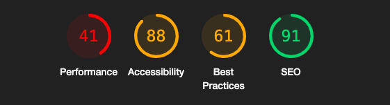
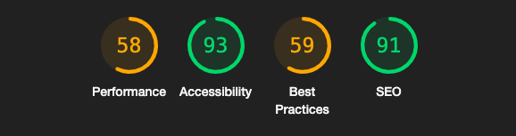
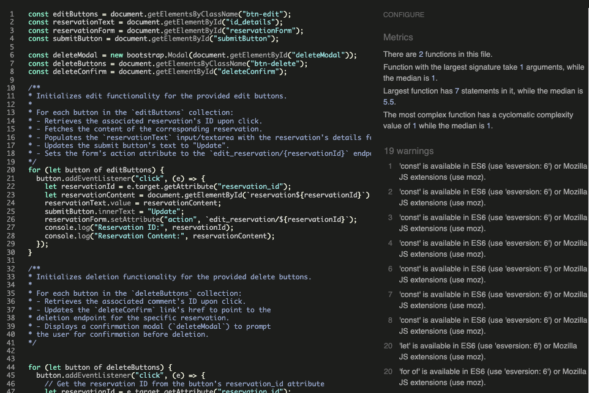
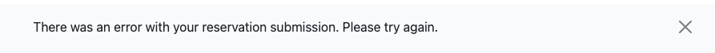
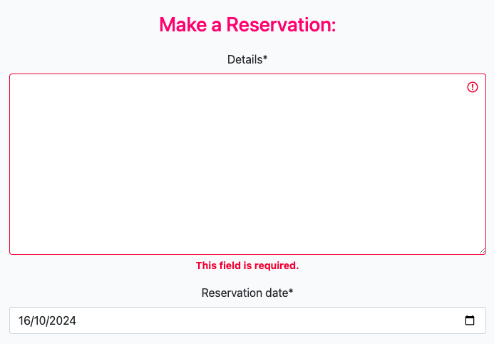

# Flamingo Terrace - Testing

Visit the deployed site: https://restaurant-pp4-fbc429f02210.herokuapp.com/

## Automated testing

### Lighthouse 

The Lighthouse validation for this project was unfortunately very low. I am aware that the images I used are of very high resolution, and even after optimizing them and reducing their size by half, they still have a high resolution. Unfortunately, I don't have the knowledge to compress them, which is something I need to study further for the next project. I'm unsure if the fact that the images are loaded from the cloud affects the app's performance. After deleting some unused files and optimizing the images, I was able to improve the score a little. But still there were some times the validator showed errors with no explanation.

#### Mobile

#### Desktop

### JavaScript validator

The JS validator showed no error besides the warning of the use of the varaible const

### Python validatos

I passed all the Python files through the validator, and there were no errors aside from some spacing issues. In most of the files, the code didn't exceed 20 lines, so I decided to show the largest Python file I had, which is the settings.py file in the main project directory. No line exceeds 99 characters.

## Manual Testing

## Admin

| TEST | OUTCOME | PASS/FAIL|
|:---:|:---:|:---:|
| Create about content | Content successfully created and displayed | Pass |
| Create reservation content | Content successfully created and displayed | Pass |
| Create index content | Content successfully created and displayed | Pass |
| Edit about content | Content successfully edited and displayed | Pass |
| Edit reservation content | Content successfully edited and displayed | Pass |
| Edit index content | Content successfully edited and displayed | Pass |
| Edit other users content | Content successfully edited and displayed | Pass |
| Delete about content | Content successfully deleted | Pass |
| Delete reservation content | Content successfully deleted | Pass |
| Delete index content | Content successfully deleted | Pass |
| Delete other users reservations | Reservation successfully deleted | Pass |
| Approve other users reservations | Reservation successfully approved and displayed | Pass |

## User

| TEST | OUTCOME | PASS/FAIL|
|:---:|:---:|:---:|
| Create Account | Created successfully | Pass |
| Login | Login Successful | Pass |
| Logout | Logout Successful | Pass |
| Create a reservation | Reservation successfully created and displayed | Pass |
| Edit a reservation | Reservation successfully edited and displayed | Pass |
| Delete a reservation | Reservation successfully deleted | Pass |

## Links testing

| TEST | OUTCOME | PASS/FAIL|
|:---:|:---:|:---:|
| Home link redirects to home page | link worked as intended | Pass |
| Logo link redirects to home page | link worked as intended | Pass |
| About Us link redirects to about page | link worked as intended | Pass |
| Reservations link redirects to reservation page | link worked as intended | Pass |
| Reservations button redirects to reservation page | button worked as intended | Pass |
| Download link download the pdf menu | link worked as intended | Pass |
| Log Out link redirects to sign out page | link worked as intended | Pass |
| Sign Out button redirects to home page | button worked as intended | Pass |
| Login link redirects to login page | link worked as intended | Pass |
| Sign In button redirects to home page | button worked as intended | Pass |
| Sign Up button redirects to home page | button worked as intended | Pass |
| Register link redirects to sign up page | link worked as intended | Pass |
| Reservation date button displays a calendar | button worked as intended | Pass |
| Reservation time button displays an hour selector | button worked as intended | Pass |
| Submit button acepts the reservation form | button worked as intended | Pass |
| Delete button displays a modal | button worked as intended | Pass |
| Modal delete button delete the reservation | button worked as intended | Pass |
| Modal cancel button cancels the reservation deletion | button worked as intended | Pass |
| Modal close button close the delete modal | button worked as intended | Pass |
| Edit button displays the selected reservation in the form | button worked as intended | Pass |
| Update button updates the selected reservation | button worked as intended | Pass |
| Footer social media icons redirect to each webpage | buttons worked as intended | Pass |
| Close message button closes the message| button worked as intended | Pass |

## Error handling

- When there is an error in the form submission, a modal is displayed with the error message.

- The form doesn't accept blank fields or spaces.

### Testing was performed on the following devices:

* Laptop:
  * Macbook Air 2018
* Mobile Devices:
  * iPhone 13 pro
  * Xiaomi 11T pro

### Each device tested the site using the following browsers:

* Google Chrome
* Safari
* Firefox

